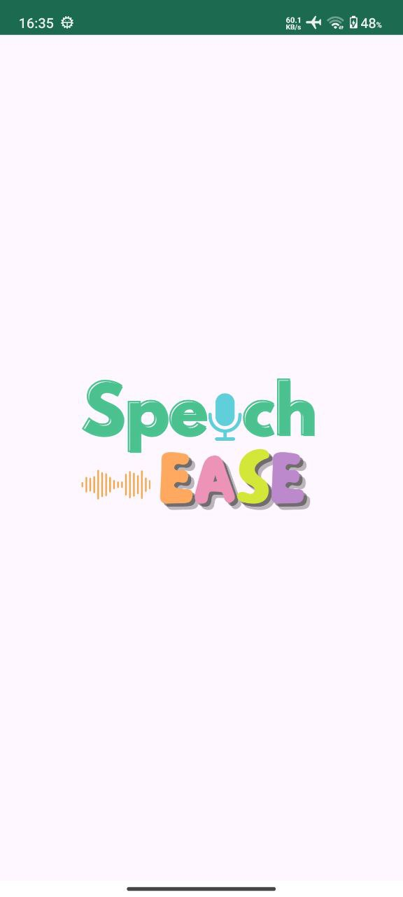
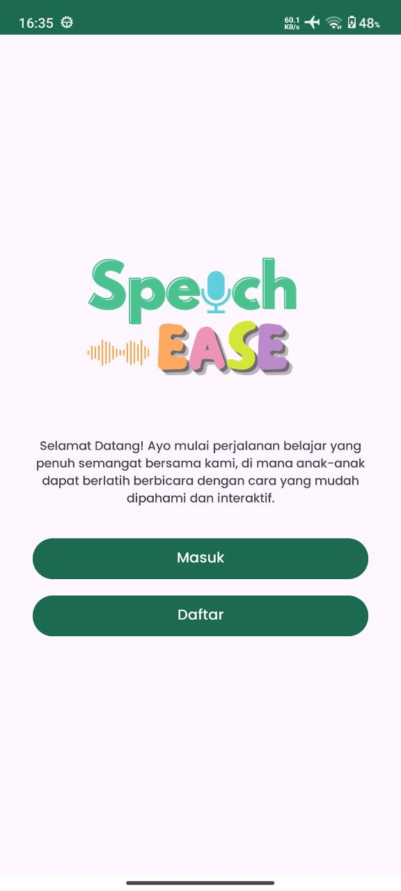
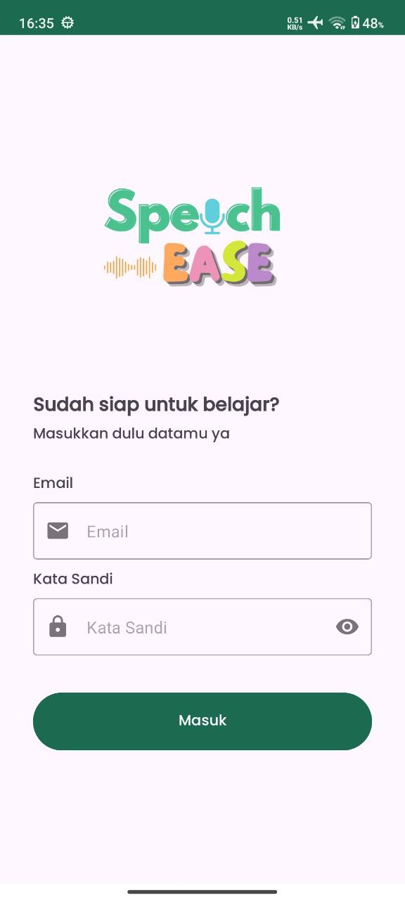
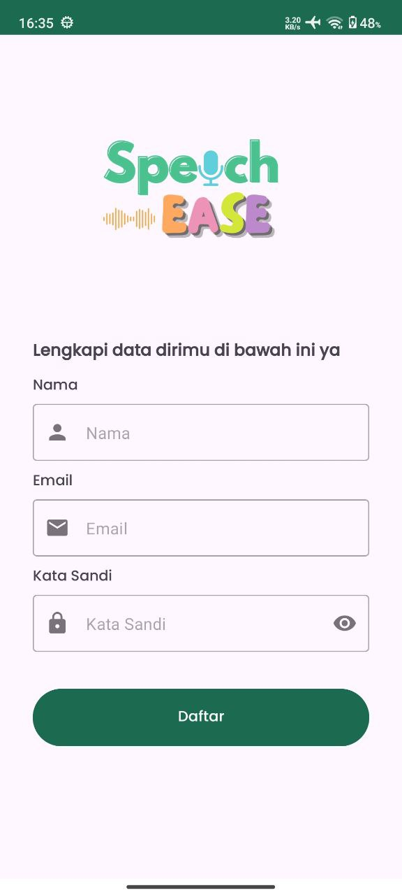
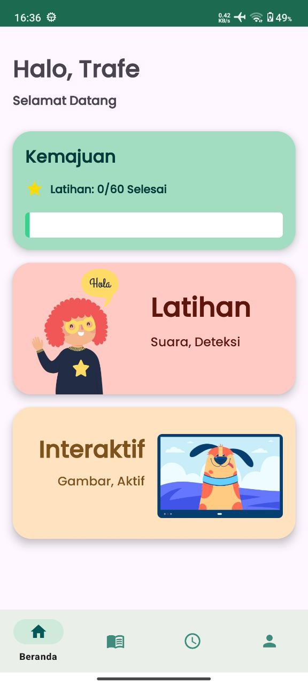
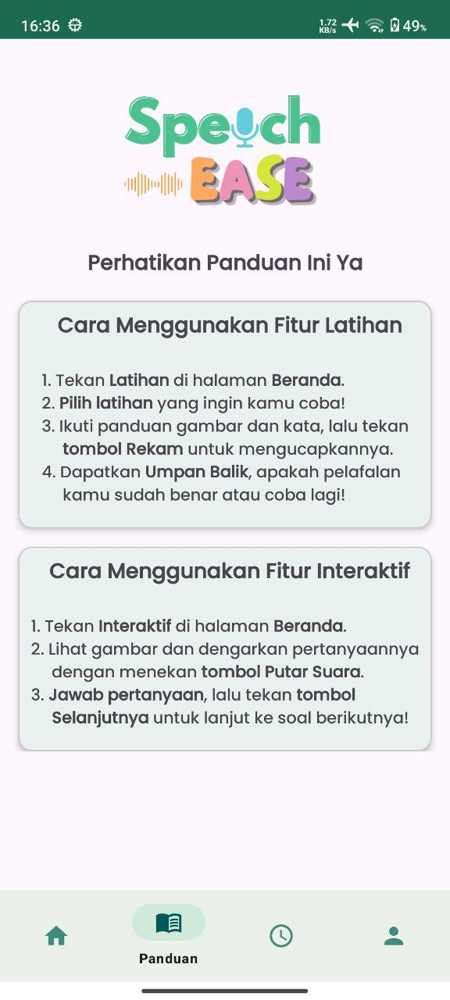
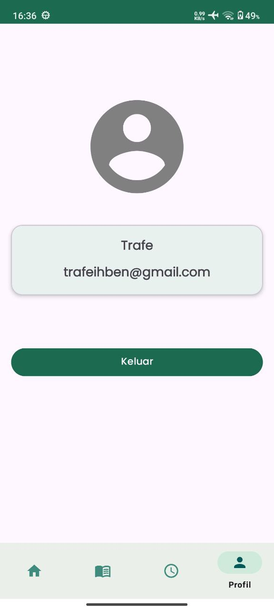
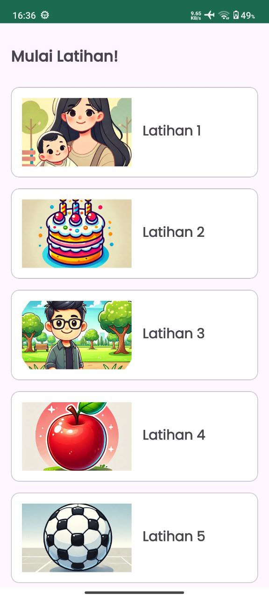
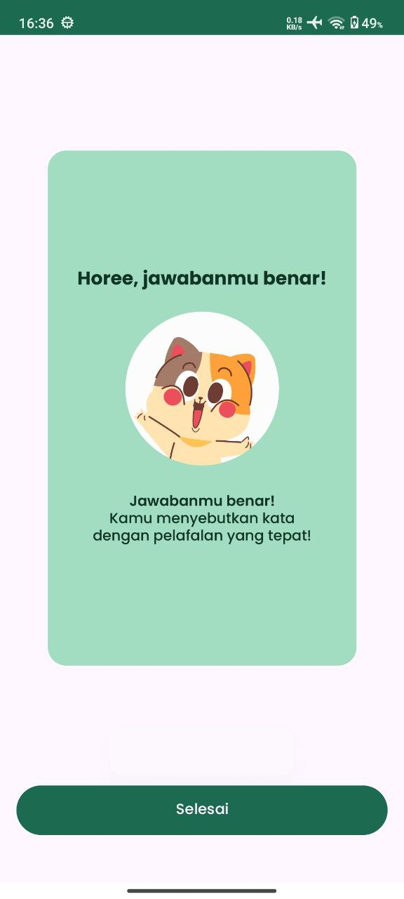
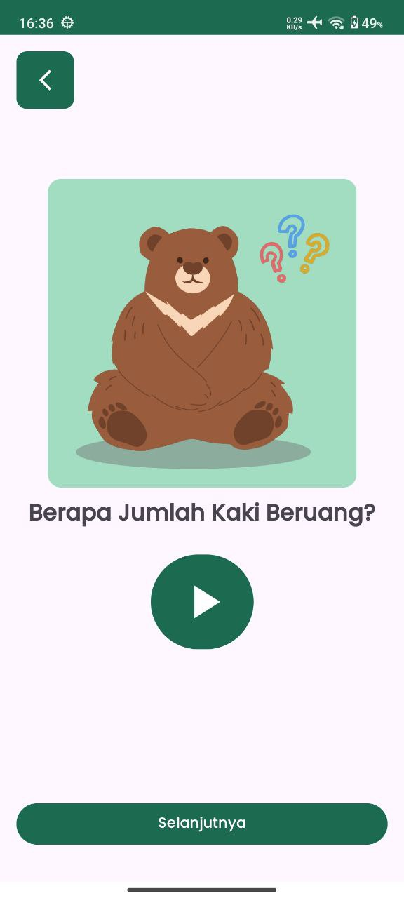

<div align="center">
  <h1>SpeechEase</h1>
  
  <h3>Bangkit 2024 Product Based Capstone Project</h3>
  <h4>Created by: C242-PS021</h4>
</div>


## Our Team Member

|ID|Name|Universitas|Linkedin|
|:-:|:-:|:-:|:-:|
|M008B4KY4244|Syah Ridho Natiqoh|Universitas Gadjah Mada|[Linkedin](https://www.linkedin.com/in/ridhonatiqoh/)|
|M283B4KX3509|Puan Bening Pastika|Universitas Negeri Semarang|[Linkedin](https://www.linkedin.com/in/puanbeningpastika/)|
|M297B4KX1603|Gertrud Irish Jovincia|Universitas Pembangunan Nasional Veteran Yogyakarta|[Linkedin](https://www.linkedin.com/in/gertrud-irish-jovincia-09412b247/)|
|C102B4KY2027|Ivander Kendrick Wijono|Institut Bisnis dan Informatika Kwik Kian Gie|[Linkedin](https://www.linkedin.com/in/ivander-kendrick-wijono/)|
|C102B4KY4487|William Susilo|Institut Bisnis dan Informatika Kwik Kian Gie|[Linkedin](https://www.linkedin.com/in/william-susilo-ws810/)|
|A283B4KY1349|Fahreza Ananda Kusuma|Universitas Negeri Semarang|[Linkedin](https://www.linkedin.com/in/fahreza-ananda-kusuma/)|
|A134B4KX3179|Nabila|Politeknik Negeri Sriwijaya|[Linkedin](https://www.linkedin.com/in/nabila-229121289/)|


## Theme
Health Innovation: Empowering Vulnerable Communities for Health and Well-being


## Backgrounder
SpeechEase is a mobile application designed to support children aged 5–10 with speech delays through an engaging and interactive therapeutic experience. Utilizing a voice recognition system, the app offers Direct Feedback and Assessment, enabling children to receive real-time evaluations of their speech progress. Coupled with Interactive Learning features such as pronunciation tasks and visual aids, SpeechEase creates a fun and supportive environment that encourages active participation and the Progress Tracking features for allows user to monitor improvements over time, ensuring a tailored and effective therapy journey. By integrating these essential features, SpeechEase aims to foster healthy speech development, improve communication skills, and enhance social and educational success.


## Screenshots
<p align="center">
  
  
  
  
</p>

<p align="center">
  
  
  
</p>

<p align="center">
  
  
  
  
</p>


## Requirement
* Android Studio Koala
* Android Device or Android Emulator


## Instalation

### 1. Clone this Project to your Computer
```bash
git clone https://github.com/bangkit-speechease/mobile-developments.git
```

or you can use Android Studio 

File > New > Project from Version Control ...

### 2. Open the Project in your Android Studio
Open Android Studio and select open an existing project.

### 3. Run Project in Android Studio
Wait for Gradle Build to Finish and finally press the `Run > Run ‘app’`. Now the app has been installed in your phone / emulator. Make sure that you have configured your android device or emulator.

### 4. Or you can download file APK
[Release](https://github.com/bangkit-speechease/mobile-developments/releases/tag/1.0)
or
[Download](https://drive.google.com/file/d/1Te3oeOuVip3eDnM_TqdlVKd2WGPmSe5a/view?usp=sharing)
